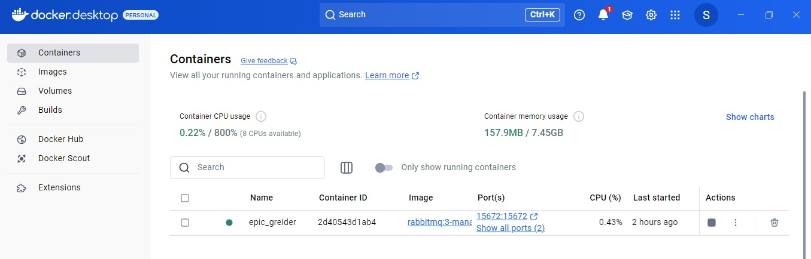
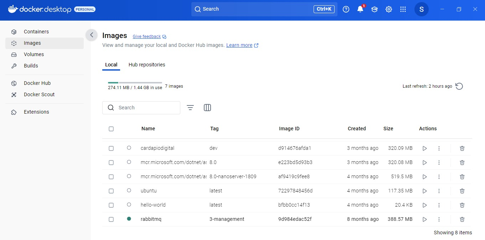
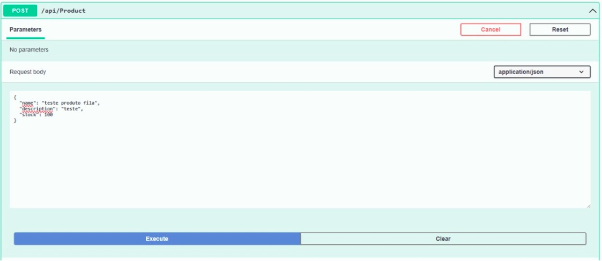
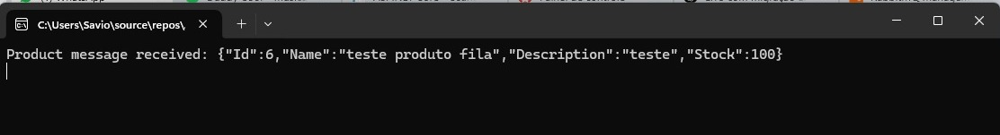
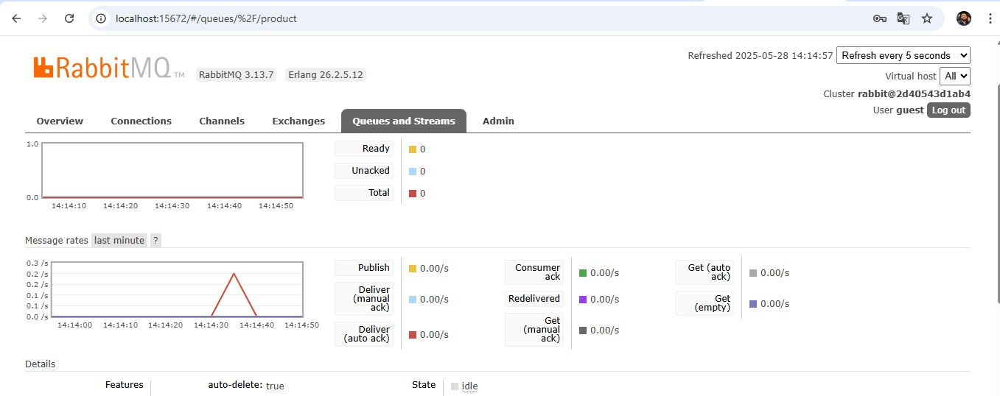

# ApiRabbitMQ - Estudo sobre RabbitMQ com .NET Core

Este projeto é um **estudo prático sobre RabbitMQ** utilizando .NET Core, composto por dois projetos principais:

- **ApiRabbitMQ**: Uma Web API desenvolvida com .NET Core, utilizando Entity Framework Core para acesso a banco SQL Server, responsável por **produzir** mensagens e enviá-las para o RabbitMQ.
- **RabbitMQ.ConsoleApp**: Um aplicativo de console em .NET Core que atua como **consumidor**, lendo as mensagens enviadas pela API via RabbitMQ.

---

## O que é RabbitMQ?

RabbitMQ é um **message broker** que implementa o protocolo AMQP, permitindo a comunicação assíncrona entre aplicações via filas de mensagens. Isso possibilita desacoplar os sistemas, aumentando a escalabilidade e a resiliência das aplicações.

No contexto deste projeto, a API Web funciona como produtora (producer) de mensagens que são enviadas para o RabbitMQ, e o aplicativo console funciona como consumidor (consumer), recebendo e processando essas mensagens.

---

## Tecnologias utilizadas

### ApiRabbitMQ (Web API)

- **.NET Core**
- **Entity Framework Core** (com SQL Server)
  - Microsoft.EntityFrameworkCore.SqlServer
  - Microsoft.EntityFrameworkCore.Design
  - Microsoft.EntityFrameworkCore.Tools
- **RabbitMQ.Client** (para integração com RabbitMQ)
- **Mapster** (para mapeamento de objetos DTOs e entidades)

### RabbitMQ.ConsoleApp (Consumer)

- **.NET Core Console App**
- **RabbitMQ.Client**

---

## Pré-requisitos

1. **SQL Server** (ou SQL Server Express) instalado na sua máquina para rodar o banco de dados.

   Você pode baixar o SQL Server Express gratuitamente aqui:  
   [https://learn.microsoft.com/pt-br/sql/database-engine/install-windows/install-sql-server](https://learn.microsoft.com/pt-br/sql/database-engine/install-windows/install-sql-server)

2. **Docker Desktop** instalado para rodar o RabbitMQ via container.

   Baixe o Docker Desktop aqui:  
   [https://docs.docker.com/desktop/install/windows-install/](https://docs.docker.com/desktop/install/windows-install/)

---

## Configuração da conexão com o banco de dados

A string de conexão utilizada no projeto ApiRabbitMQ está no formato:

```json
"User Id=seuUsuario;Password=suaSenha;Data Source=(local);Initial Catalog=DB_RABBIT_MQ;TrustServerCertificate=True;Application Name=ApiRabbitMQ"
```

- Substitua `seuUsuario` e `suaSenha` pelo seu usuário e senha do SQL Server.
- `Data Source=(local)` indica que o banco está rodando localmente na sua máquina.
- O banco `DB_RABBIT_MQ` será criado automaticamente pela migration.

---

## Como executar o projeto

### 1. Rodar o RabbitMQ no Docker

Abra o Docker Desktop e espere ele iniciar, você pode verificar o status do docker executando o comando abaixo:

```bash
docker info
```

Se estiver tudo ok, abra o terminal e execute:

```bash
docker pull rabbitmq:3-management
docker run --rm -it -p 15672:15672 -p 5672:5672 rabbitmq:3-management
```

Confira no Docker Desktop se o container RabbitMQ está rodando corretamente:



Verifique também as imagens baixadas no Docker Desktop:



- A interface de gerenciamento do RabbitMQ estará disponível em [http://localhost:15672](http://localhost:15672)
- Usuário padrão: `guest`
- Senha padrão: `guest`

---

### 2. Rodar a migration e criar o banco

No Visual Studio, abra o **Package Manager Console** com o projeto ApiRabbitMQ selecionado e execute:

```powershell
# A migration InitialMigration já existe, então este passo não é obrigatório, mas pode ser executado caso queira recriar o banco
Add-Migration InitialMigration

# Aplica as migrations e cria o banco
Update-Database
```

- A migration criará automaticamente o banco `DB_RABBIT_MQ` e as tabelas necessárias.

---

### 3. Configurar múltiplos projetos de inicialização

Para facilitar o desenvolvimento, configure na solução para que os dois projetos rodem simultaneamente:

- Clique com o botão direito na solução > Propriedades
- Vá na aba "Projetos de Inicialização"
- Selecione "Múltiplos projetos"
- Configure para iniciar a Web API `ApiRabbitMQ` e o console `RabbitMQ.ConsoleApp` juntos.

---

### 4. Enviar uma mensagem (Producer) via Web API

- Com a Web API rodando, acesse o Swagger no endereço:

```
https://localhost:<porta>/swagger
```

- Execute a requisição POST para o endpoint `/api/Product` com o JSON no corpo:

```json
{
  "name": "teste produto fila",
  "description": "teste",
  "stock": 100
}
```



---

### 5. Receber a mensagem (Consumer)

- Com o `RabbitMQ.ConsoleApp` rodando, o consumidor vai receber a mensagem e imprimir no console:

```
Product message received: {"Id":6,"Name":"teste produto fila","Description":"teste","Stock":100}
```



---

### 6. Visualizar a mensagem na interface do RabbitMQ

- Acesse o painel de administração do RabbitMQ no navegador:
- Na aba **Queues**, selecione a fila `product` para visualizar as mensagens enviadas.


